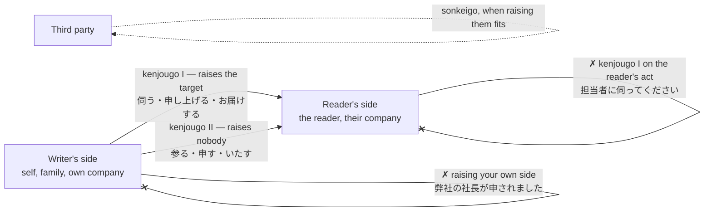
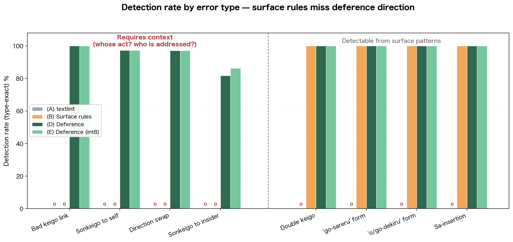
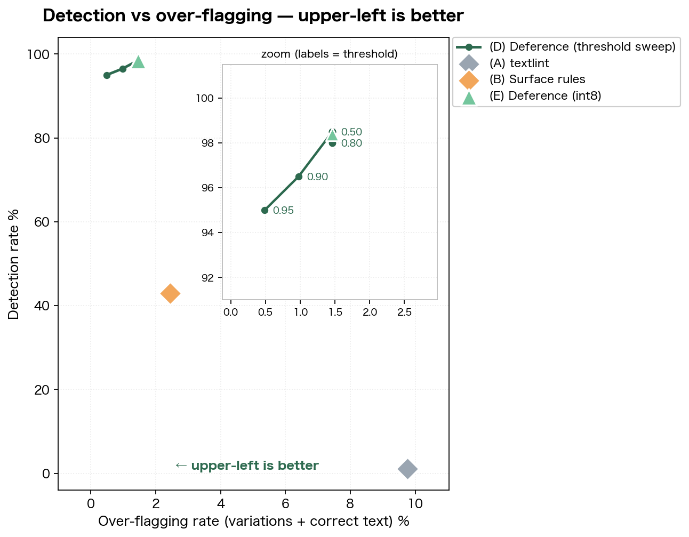
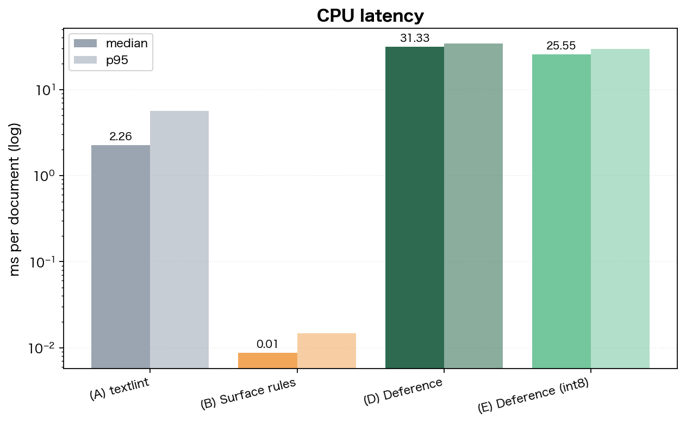
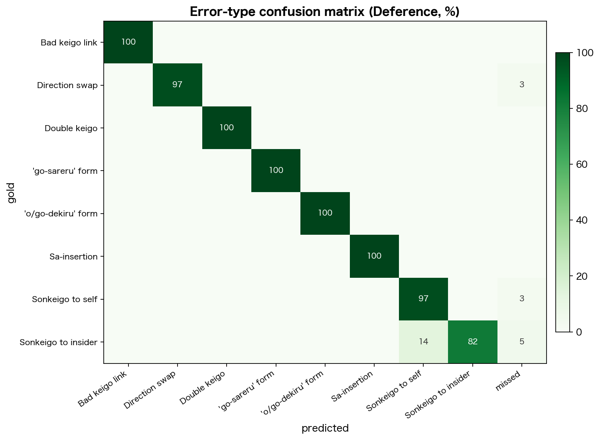

# Deference

**The direction of deference, with the source to back it up.**

A rule-based Japanese linter says nothing about 「お持ちします」. As a string it is
fine. But **if the reader is the one carrying something, that form does not raise
them** — it raises whoever the act is directed to, which here is the writer.

Deference decides from *whose action it is*, *who it is directed to*, and *whether
the message goes inside or outside your company*, then cites the page of the
Council for Cultural Affairs' **Keigo no Shishin** (敬語の指針, 2007) that the
judgement rests on. 26 ms on CPU.

[](https://github.com/NagaYu/deference/actions/workflows/ci.yml)
[](https://huggingface.co/NagaYu/deference-keigo)
[](https://huggingface.co/datasets/NagaYu/deference-keigo-corpus)
[](https://huggingface.co/spaces/NagaYu/deference)

```console
$ deference check mail.txt --audience external

  1. 「おっしゃっておりました」  [Respectful form for one's own side (uchi)]
     Because the message is addressed outside the company, 「おっしゃっておりました」
     raises someone on your own side. The relevant passage is Ch.3 Sec.3-2 Q25
     (p.44-45). It reads: 「社外の人が多くいる場合には，会社のウチ・会社のソトといった
     関係が生じるので，「ウチ」の社長は立てない方が良い。」
     Alternative forms: 申しておりました / 言っておりました
     Basis: Council for Cultural Affairs, Keigo no Shishin (2007-02-02)
            Ch.3 Sec.3-2 Q25 (p.44-45)
```

---

## Why rules cannot reach this

The definitions in the guidelines are the whole answer (Ch.2 Sec.1, pp.14–15).

| class | definition | raises |
|---|---|---|
| **sonkeigo** (respectful) | describes the actions of the other party or a third party, speaking of that person in a raised manner | **the one who acts** |
| **kenjougo I** (humble) | describes actions directed from one's own side toward the other party, raising the person they are directed to | **the one addressed by the act** |
| **kenjougo II** (courteous) | describes one's own actions courteously to the reader | nobody |

So appropriateness **is not a property of the string**.



The same characters flip verdict with the standpoint:

| text | who carries | under the guidelines |
|---|---|---|
| 課長、資料をお持ち**します**か | the writer | appropriate |
| 課長、資料をお持ち**します**か | the section chief | does not raise them (Ch.3 Sec.2-2 Q11, p.37) |

…and with the audience (Ch.3 Sec.3-2 Q25, pp.44–45):

| audience | appropriate form |
|---|---|
| an internal gathering | 社長からごあいさつを**頂きます** |
| a gathering with outside guests | 社長からごあいさつを**申し上げます** |

A regular expression sees only characters. Without *whose action*, *directed to
whom*, and *addressed to whom*, this judgement is **out of reach in principle**.

---

## Evaluation

Conditions: **(A)** textlint with four Japanese presets · **(B)** a surface-rule
set · **(C)** a general-purpose LLM · **(D)** Deference · **(E)** Deference after
int8 quantisation. Evaluation set: 559 texts with errors, 152 without, 53
variation cases.

| condition | detection (span) | detection (type) | **direction errors** | no-over-flag | FP on clean text | correction validity | median | p95 |
|---|---|---|---|---|---|---|---|---|
| (A) textlint | 1.1% | 0.0% | **0.0%** | 94.3% | 11.2% | 0.0% | 2.26 ms | 5.65 ms |
| (B) surface rules | 42.9% | 42.9% | **31.7%** | 90.6% | 0.0% | 0.0% | 0.01 ms | 0.01 ms |
| (C) general LLM | — | — | — | — | — | — | — | — |
| (D) Deference | 98.4% | 97.9% | **97.4%** | 100.0% | 2.0% | 60.4% | 31.33 ms | 34.15 ms |
| (E) Deference (int8) | 98.4% | 98.0% | **97.6%** | 100.0% | 2.0% | 60.2% | **25.55 ms** | 29.66 ms |

**(C) was not measured.** `ANTHROPIC_API_KEY` was unset, so the condition is
recorded as unavailable with the reason in `benchmarks/results.json` — no numbers
were invented for it. Set the key and pass `--conditions C` to fill the row.

### Detection rate by error type



The left block is **errors that cannot be decided without context**; the right
block is **errors visible in the surface pattern**.

- On the left, (A) and (B) are at **0.0%** across the board. Deference reaches 86–100%.
- On the right, (B) and Deference are **both at 100%**. No advantage is claimed there.

The gap appears exactly where a surface-pattern tool has no route — which is the
point being made, and nowhere else.

### Detection rate vs over-flagging



Upper-left is better. Deference sits at 98% detection with 1.5% over-flagging.
textlint detects 1% while over-flagging 9.7% — its punctuation and sentence-length
rules fire on perfectly correct text.

| CPU latency | Error-type confusion |
|---|---|
|  |  |

Japanese-labelled versions of all four figures are in [`figures/ja/`](figures/ja).

---

## Install and use

```bash
pip install -e .
```

Three lines:

```python
from deference import Deference, MailContext, Audience

result = Deference().check(open("mail.txt").read(), MailContext(audience=Audience.EXTERNAL))
for f in result.reportable: print(f.span.text, f.message, f.citation.render("en"))
```

CLI:

```bash
deference check mail.txt --audience external
```

Changing the audience changes the result — that is the core of the design:

```bash
deference check mail.txt --audience internal   # in-group honorifics move to "variation"
```

Other subcommands:

```bash
deference explain uchi_sonkeigo   # how an error type works, with the source
deference forms 言う               # correct forms for each standpoint
deference demo                    # built-in sample, internal vs external
deference check mail.txt --lang ja  # output in Japanese
```

Naming the people in the text is what makes direction decidable:

```bash
deference check mail.txt --audience external \
  --person 佐藤:self_group --person 田中:addressee
```

---

## Variation is not error

**This is what makes the tool usable.** Painting every divided usage red destroys
trust in a checker. The guidelines say as much themselves:

> 男女の違いや世代の違いなどによって画一的に考える態度は避けるべきである。
> *(One should avoid treating usage uniformly by gender or generation.)*
> — Ch.1 Sec.2-2, p.8

`VariationSet` holds 53 such cases and reports none of them by default.

| expression | status | source |
|---|---|---|
| お伺いする / お召し上がりになる / お見えになる | doubled honorifics established by custom | Ch.2 Sec.2-6(2), p.30 |
| お読みになっていただく / ご案内してさしあげる | acceptable honorific chains | Ch.2 Sec.2-6(3), p.30 |
| ご利用いただく ↔ ご利用くださる | both appropriate | Ch.3 Sec.2-5 Q17, p.40 |
| ご持参ください / お申し出ください | no problem | Ch.3 Sec.2-3 Q14, p.38 |
| させていただく (as-if usage) | tolerance varies by individual | Ch.3 Sec.2-6 Q18, pp.40-41 |
| raising a middle manager to their superior | both views have merit | Ch.3 Sec.3-2 Q26, p.45 |
| 高いです / 水をあげる / 了解しました / ra-nuki | shifting, or outside the report's scope | — |

The **100.0% no-over-flag** figure in the table above is measured against these 53.

## It does not tell you your Japanese is wrong

Output stays informational — how the guidelines organise the matter, not a verdict.
`tests/test_tone.py` enforces this in both languages, checking that phrases like
"is wrong" / "mistake" / 「間違い」 / 「誤用」 never reach the user.

| ✗ | ✓ |
|---|---|
| This is a doubled honorific and it's wrong | The guidelines describe doubled honorifics as "generally regarded as not appropriate" (p.30) |
| Error / needs fixing | Notes from the guidelines / alternative forms |

Every run closes with:

> Honorifics are chosen as a form of self-expression (Keigo no Shishin, Ch.1 Sec.1-3).
> What is shown here is how the guidelines organise the matter; it is not a
> judgement on the writer's Japanese.

---

## How it works

```
message body + MailContext (audience, own/other organisation, each person's standpoint)
   ↓
RoleTagger      per predicate: who acts, who it is directed to  (no morphological analyser)
   ↓
NormDetector (rules)  ⟷  ErrorSpanClassifier (BIO × type, 0.28B)
   ↓
                 rule verification — predictions the rules can refute are dropped
   ↓
VariationSet    divided usage → Verdict.VARIATION (not reported by default)
   ↓
Corrector       suggestions, **restricted to the set the rules can generate**
   ↓
RuleCitation    chapter, question number, page, URL
```

- **Model** — token classification on `xlm-roberta-base`, **277.5M parameters
  (0.277B)**. Validation **F1 0.988**, direction-only **F1 0.978**.
- **Quantisation** — ONNX dynamic int8, **1111.7 MB → 279.4 MB**, 31.3 → 25.6 ms.
- **Constrained correction** — candidates never leave the set returned by
  `Generator.correct_forms()`. Free generation would let the suggestion itself
  become a new divergence from the norm.
- **Constraining the model by the norm** — for types whose truth is checkable on
  the surface (sa-insertion, doubled honorifics, the `go-...-sareru` pattern), a
  model prediction is verified against the rules and discarded if it cannot hold
  (`NormDetector.is_possible`). The model flagged 「ご報告させていただきます」 as
  sa-insertion; 報告する is a *suru* verb, so that reading is impossible.
- **Silence over guesswork** — where the actor cannot be read from the text, no
  direction judgement is made (`_ACTOR_EVIDENCE_MIN`). Guessing costs more trust
  than it gains.

## Data

Errors are **all produced by rule. No LLM is involved.** The labels are exact and
no teacher bias enters.

| split | rows | purpose |
|---|---|---|
| train / validation / test | 3280 / 410 / 411 | training and evaluation |
| **variation** | 53 | divided usage. **A flag here is a false positive** |
| **direction** | 1564 | direction errors only, including the report's worked examples |

```bash
python scripts/build_dataset.py  --output data/hf
python scripts/train.py          --data data/hf --output checkpoints/deference-base
python scripts/export.py         --model-dir checkpoints/deference-base --format all --quantize
python scripts/run_benchmarks.py --data data/hf --output benchmarks/results.json
python scripts/make_figures.py
```

Add `--push-to-hub --hub-repo-id <you>/<name>` to `build_dataset.py`,
`train.py` or `export.py` to publish.

## Gradio app

```bash
python app.py
```

Paste a message body, choose the audience, and each passage is highlighted by type
with the source and alternative forms. The **textlint result is shown side by
side**, sorted into *only Deference*, *only textlint* and *both*.

To publish it as a Hugging Face Space:

```bash
python scripts/publish_space.py --repo-id <you>/deference
```

The Space pulls the weights from the model repo rather than bundling them, and
installs the textlint baseline on first start so the side-by-side view is live.
Note that **hosting a Gradio Space on free cpu-basic requires Hugging Face PRO**
(static Spaces are free); without it the script reports the 402 and stops.

## Tests

```bash
python -m pytest tests/ -q      # 181 passed, 2 skipped
```

The four checks the design calls for (each prints its measured value):

| check | measured |
|---|---|
| generated correct forms are not flagged | false-positive rate **0.00%** (400 correct sentences, rule engine) |
| injected spans and types are recovered | **59.5%** on context-dependent types (rule engine alone) |
| variation cases raise no flag | **53/53** |
| suggestions stay within the rule-generated set | all 616 candidates `generated_by == "rule"` |

Plus: no accusatory wording in either language, results change with the audience,
gold restores the original text (100%), and applying a suggestion clears the note
(99.3%).

> The recovery figure above is for the rule engine alone, since the tests run
> `engine="norm"`. With the trained checkpoint in the default hybrid configuration
> the same types reach **97.4%** (see `benchmarks/results.md`).

## Limitations

- **Dialects are out of scope** — the report discusses regional variety
  (Ch.1 Sec.2-1), but this targets standard written business Japanese.
- **Spoken language is out of scope.** Sa-insertion is widespread in speech; it is
  treated here from the standpoint of written norms, and the citation says so.
- Where the actor is not recoverable from the text, **no judgement is made** rather
  than a guessed one.
- The generator's lexicon (49 verbs, 35 suppletive forms) bounds the distribution.
  Scores here do not by themselves establish performance on real correspondence.
- **Industry adapters are scaffolding only** — untrained, so the effect is recorded
  as not measured in `benchmarks/results.md`.
- Correction validity is 60%: a suggestion matches the gold form or restores the
  original text in that share of recovered spans. The remainder are usually
  span-granularity mismatches rather than wrong forms.

## Source and how it is quoted

Adapted from the Council for Cultural Affairs' report *Keigo no Shishin*
(敬語の指針), Agency for Cultural Affairs, 2007.
<https://www.bunka.go.jp/seisaku/bunkashingikai/kokugo/hokoku/pdf/keigo_tosin.pdf>

Content on the Agency's site follows the
[MEXT website terms of use](https://www.mext.go.jp/b_menu/1351168.htm), which state
conformance with the Public Data License (v1.0), are described as **compatible with
CC BY**, and permit reproduction, public transmission, translation and adaptation
provided the source is credited — commercial use included. Where the material has
been **edited or adapted, that fact must be stated**, and it is stated here.

This project keeps **only the short quotations needed as the basis for each note**
(definitions, listed forms, key sentences) in `deference/norms.py`, each tagged with
chapter, section, question number and page. **The report is not redistributed in
full and the PDF is not included.** Details in
[docs/keigo_shishin_reference.md](docs/keigo_shishin_reference.md).

Note that **sa-insertion is not discussed by the Keigo no Shishin.** Deference does
not dress it up as a citation from the report; the basis given is the conjugation
rule itself, under a separate `Citation.source`.

## Layout

```
deference/
  types.py      shared contract (Party / KeigoClass / ErrorType / Verdict / MailContext …)
  norms.py      the norm database (five classes, suppletive forms, inflection, citations, variation)
  generate.py   Generator      correct forms from standpoint × predicate × politeness
  inject.py     ErrorInjector  documented error types, injected by rule
  variation.py  VariationSet   53 cases of divided usage
  roles.py      RoleTagger     who acts, who it is directed to
  detect.py     NormDetector   norm ⟷ standpoint
  model.py      ErrorSpanClassifier (BIO × error type, 0.28B)
  correct.py    Corrector      constrained suggestions
  cite.py       RuleCitation   the source, and an explanation you can learn from
  pipeline.py   Deference      the entry point
  cli.py        deference check / explain / forms / demo
  baselines.py  comparison conditions (A) (B) (C)
scripts/  build_dataset.py train.py export.py run_benchmarks.py make_figures.py
tests/    11 files, 183 tests
docs/     keigo_shishin_reference.md (source handling) · design.md (design notes)
app.py    Gradio Space
```

Docstrings are written in Japanese, because the subject matter is the Japanese
norm and precision matters more than reach there. Each one states which of the
four claims it supports — direction detection, low over-flagging, citation, speed:

```bash
grep -rc "実証する主張" deference/   # 183/183 public functions and classes
```

## Licence

Code: Apache-2.0.
Norm data: as stated above — CC BY compatible, credit required.
