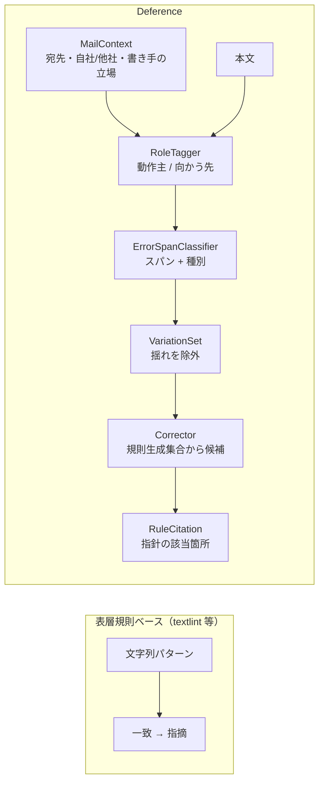
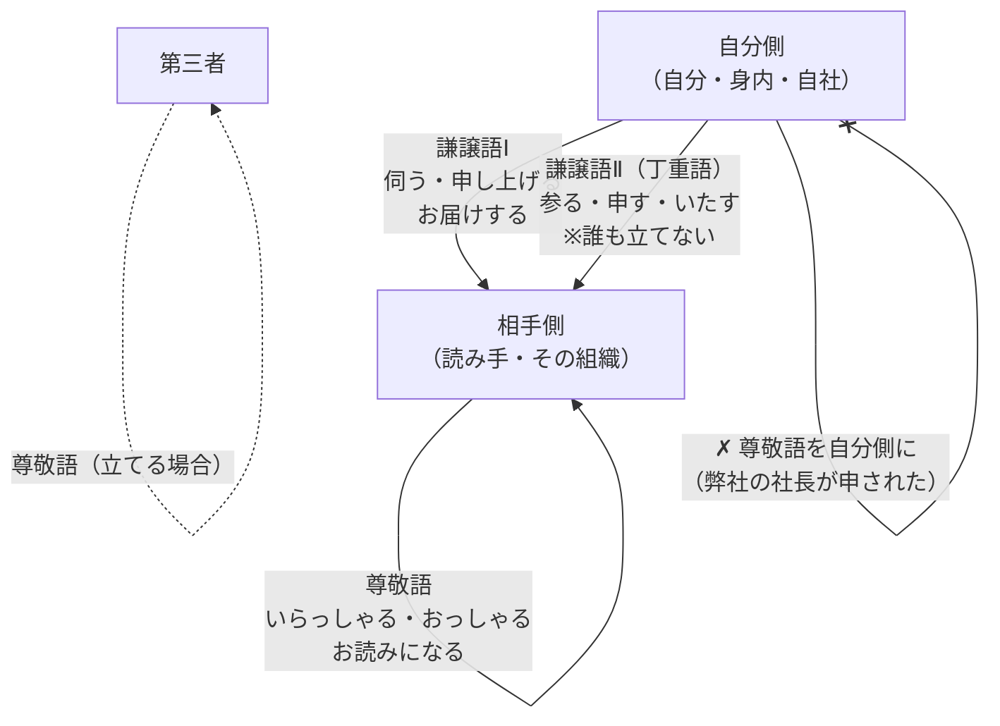

# Deference の設計

## 何を主張し、どう実証するか

このリポジトリは4つの主張を持つ。各モジュールの docstring には、それがどの主張を
実証するのかが明記されている（`grep -r "実証する主張" deference/`）。

| # | 主張 | 実証する場所 |
|---|---|---|
| 1 | **敬意の向きの誤りを検出できる** — 表層規則では原理的に捕まらない類 | `benchmarks/` の (1)、図1 |
| 2 | **過剰指摘が少ない** — 揺れを誤りにしない | `benchmarks/` の (2)、図2、`tests/test_variations_not_flagged.py` |
| 3 | **根拠を示せる** — 規範の該当箇所に対応づく | `deference/cite.py`、`tests/test_norms.py` |
| 4 | **CPU で即応する** | `benchmarks/` の (5)、図3 |

## なぜ規則ベースでは「向き」が捕まらないのか

「敬語の指針」第2章第1 の分類定義を読むと理由が見える。

- **尊敬語**は「相手側又は第三者の行為…について、**その人物を立てて**述べるもの」
- **謙譲語Ⅰ**は「自分側から相手側又は第三者に向かう行為…について、
  **その向かう先の人物を立てて**述べるもの」

つまり適否は述語の表層では決まらない。同じ「お持ちする」が、

- 自分が持っていく → 適切（〈向かう先〉である相手を立てている）
- 相手が持っていく → 不適切（指針【11】、p.37）

さらに同じ文が宛先によって反転する（指針【25】、p.44–45）。

- 社内の会で「社長からごあいさつを**頂きます**」→ 適切
- 社外の人が多い会で同じ文 → 「ウチ」の社長を立ててしまうので不適切。
  「社長からごあいさつを**申し上げます**」が適切

正規表現は文字列しか見ない。**誰の行為か・誰に向かうか・宛先は誰か**を持たない
以上、この判定はできない。これが構造的な差であり、ベースラインを強く作っても
埋まらない。

## 敬意の向き

- **尊敬語**は矢印の先が〈行為者〉を向く。行為者が自分側なら成立しない。
- **謙譲語Ⅰ**は矢印の先が〈向かう先〉を向く。向かう先が自分側なら成立しない
  （「弟のところに伺います」は誤用、指針【13】）。
- **謙譲語Ⅱ**は誰も立てず、聞き手・読み手に丁重に述べるだけ。だから
  自分側の行為に自由に使えるが、話の中の第三者を立てる働きは持たない。

## 4つのコア

### 1. RoleTagger（`deference/roles.py`）

文中の述語ごとに動作主と〈向かう先〉を推定する。手掛かりは、明示的な主語、
一人称・二人称、格助詞、授受動詞、そして `MailContext` のメタ情報。日本語は
主語が落ちるので、直前の文からの引き継ぎ（ゼロ照応の素朴な近似）も行い、
引き継いだ場合は確信度を下げて `evidence` に残す。

形態素解析器には依存しない（MeCab/fugashi 不要）。`norms.py` の語形一覧と
活用関数から表層辞書を作って照合する。

### 2. ErrorSpanClassifier（`deference/model.py`）

誤りのスパンと種別を予測する系列ラベリング（BIO × ErrorType）。
backbone は SentencePiece ベースで fast tokenizer を持つもの（既定
`xlm-roberta-base`、約 0.28B）。fast tokenizer の `offset_mapping` を使って
サブワード予測を**本文の文字オフセット**に戻す。

文脈は短いプレフィックス（`[社外][書き手:自分側][相手:貴社]`）として本文の前に
連結し、`prefix_len` を返して本文基準のオフセットに復元する。

`torch` / `transformers` は遅延 import。CLI の起動を速く保つため
（主張4に直結）。

### 3. Corrector（`deference/correct.py`）

**拘束付き生成。** 候補は `Generator.correct_forms()` が返す集合か、
`norms.py` から機械的に導ける形に限る。自由生成させると修正案そのものが新たな
規範逸脱になりうるため、それを構造的に封じる。`tests/test_suggestions_in_rule_set.py`
がこの不変条件を検査する。

### 4. RuleCitation（`deference/cite.py`）

誤り種別（＋文脈）を規範の該当分類・該当説明に対応づける。文脈で引用が変わる
（`UCHI_SONKEIGO` は社外宛なら指針【25】、社内宛なら【26】）。

**利用者が学べる出力にすることが製品価値の中心**なので、`teach()` は5分類の
定義を引きながら仕組みを説明する。

## データ構築

### Generator — 正解を規範から構成する

「動作主の立場（自分／身内／相手／第三者）× 述語 × 目標敬意度」から、
**正しい敬語形をプログラムで生成**する。

- 特定形を持つ動詞（言う・行く・来る・いる・する・見る・食べる 等）と
  一般動詞（お〜になる／〜れる、お〜する）を分けて扱う
- 一般形の生成には指針の制約をそのまま実装する:
  - 「お(ご)……する」は〈向かう先〉のある動詞に限る（`Verb.has_target`）
  - 「……いたす」はサ変動詞のみ
  - 「お」は和語＋連用形、「ご」は漢語サ変＋語基（`Verb.ogo_stem`）
  - 「お(ご)……になる」が作れない動詞がある（`NO_OGO_VERBS`）
  - 可能形は「まず敬語形にしてから可能形」
- 授受表現（いただく／くださる／差し上げる）、依頼・断り・謝罪・感謝・報告・
  問い合わせ・日程調整・告知・あいさつを `FunctionTag` で網羅

### ErrorInjector — 文書化された誤り型を注入する

**LLM に誤りを作らせない。** 規則で作ることでラベルが厳密になり、教師バイアスも
入らない。位置（`Span`）と種別（`ErrorType`）を記録し、`InjectedError.gold_suggestions`
に規範上の正しい形を持つ。

| # | 種別 | 例 |
|---|---|---|
| i | 二重敬語 | お読みになられる |
| ii | 尊敬語と謙譲語Ⅰの取り違え | 担当者に伺ってください／課長、お持ちしますか |
| iii | 身内に尊敬語 | 弊社の社長が申されました |
| iv | さ入れ言葉 | 休まさせていただきます |
| v | 「させていただく」の過剰使用 | 1通に高密度で反復 |
| vi | 敬体と常体の混在 | です・ます の中に常体 |
| vii | 敬意の程度の不整合 | 相手より身内を高く述べる |

派生型として `GO_SARERU`（ご利用される、指針【7】）、`OGO_DEKIRU`（ご乗車できません、
指針【8】）、`BAD_KEIGO_LINK`（伺ってください、p.30–31）、`SELF_SONKEIGO`
（私のお考え、指針【16】）も実装する。

**定着した二重敬語は生成しない。** 「お伺いする」は指針が定着を認めている
（p.30）ので、これを誤りとして注入するとラベルが規範に反する。

### VariationSet — 揺れを別扱いにする

許容度が場面や世代で変わる表現を集め、**「誤り」ではなく「揺れ」**として
別ラベル（`Verdict.VARIATION`）を付ける。ここを誤りにすると実用に耐えない。

根拠は指針自身にある。第1章第2-2（p.8）は「男女の違いや世代の違いなどによって
画一的に考える態度は避けるべきである」と述べ、第3章第2-6【18】は
「させていただく」の許容度は個人差だとする。

### 文脈

単文ではなくメール本文全体で判定する。`MailContext` が宛先・自社/他社の関係・
書き手の立場を持ち、`Generator.generate_mail()` は本文全体を生成する。
`DEFERENCE_INVERSION`（敬意の逆転）は単文では原理的に判定できず、本文全体の
敬語分類の分布を見る必要がある。

## 評価の設計

| 条件 | 内容 |
|---|---|
| (A) | textlint（日本語プリセット）— 実プロセスを起動して実測 |
| (B) | 無料のオンライン校正ツール相当の規則群 — 表層パターンのみ。`MailContext` を参照しない |
| (C) | 汎用の大規模LLM（プロンプトのみ） |
| (D) | Deference（量子化前） |
| (E) | Deference（量子化後、ONNX int8） |

(B) は**手加減せずに強く作る**。それでも向きが捕まらないことを示すのが目的なので、
弱いベースラインでは実証にならない。また (B) は設計上 `MailContext` を受け取らない
（受け取ったら「表層規則」ではなくなる）。

評価軸は6つ。詳細は `scripts/run_benchmarks.py` と `benchmarks/results.md`。

**利用不能な条件の数字は捏造しない。** API キーが無い (C) や ONNX 未生成の (E) は、
結果 JSON に理由を明記して skip する。

## 文言の設計

利用者の日本語を否定する物言いをしない。これは製品要件であり、
`tests/test_tone.py` が守る。

| ❌ | ✅ |
|---|---|
| これは二重敬語で誤りです | 指針は二重敬語について「一般に適切ではないとされている」と説明しています（p.30） |
| 身内に尊敬語を使うのは間違いです | 社外宛の文では、自社の方は「立てない側」として述べるのが指針の整理です（【25】） |
| エラー / 修正が必要です | 規範上の案内 / 別の形の候補 |

根拠は指針 第1章第1-3「『自己表現』としての敬語使用」と 第3章第1-4
「敬語は過剰でなく適度に使う」。
